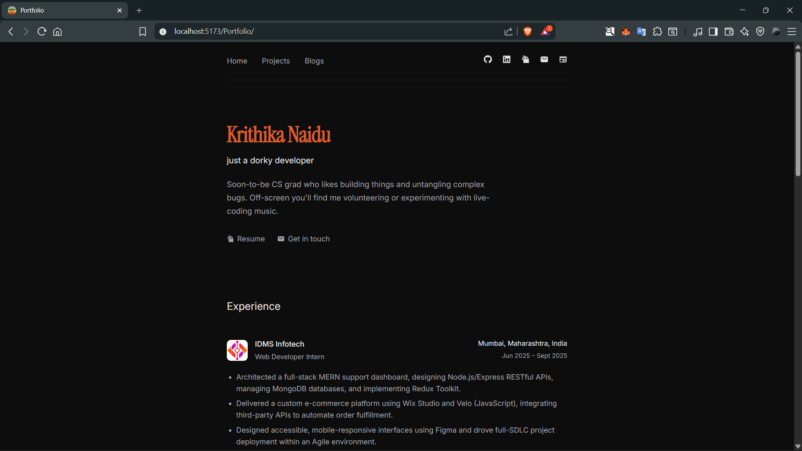
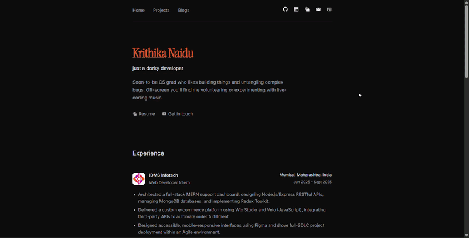

<div align="center">

# Hi, I'm Krithika 👋
### just a dorky developer

[](https://krithika.github.io/Portfolio/)
[](https://react.dev/)
[](https://vitejs.dev/)
[](https://pages.github.com/)

</div>



<!--
  📸 Drop a screenshot or screen-recording GIF of the live site here.
  
-->

---

## About

This is my personal developer portfolio — built to be minimal, dark, and a little dorky rather than a wall of resume bullet points. It's where I show off what I'm building, what I'm debugging, and what I'm tinkering with outside of class..

**Live site:** [krithika.github.io/Portfolio](https://krithika.github.io/Portfolio/)
**Reference site:** [Dhvanit Monpara/Portfolio](https://www.dhvanitmonpara.in/)

## Features

- Minimal, dark-themed UI with a custom cursor spark particle effect
- Client-side routing (React Router) with dedicated project detail pages
- Projects grid linking out to individual `/projects/:slug` pages
- Dedicated Get in Touch page
- Links to my [Substack](#), [GitHub](#), and [LinkedIn](#)

## Tech Stack

| Layer | Tools |
|---|---|
| Framework | React + Vite (JavaScript) |
| Routing | React Router (`react-router-dom`) |
| Icons | `react-icons` |
| Styling | Plain CSS, design tokens via CSS variables |
| Fonts | Instrument Serif (headings), Inter (body) |
| Deployment | GitHub Pages (`gh-pages`) |

## Getting Started

```bash
# clone the repo
git clone https://github.com/krithika/Portfolio.git
cd Portfolio

# install dependencies
npm install

# run locally
npm run dev

# build for production
npm run build

# deploy to GitHub Pages
npm run deploy
```

> ⚠️ This app is deployed to a subpath (`/Portfolio/`). The Vite `base` config and the React Router `basename` must both match the repo name, or routes will silently fail while the navbar still renders.

## Project Structure

```
src/
├── components/        # Navbar, CursorSparks, ExperienceItem, ProjectCard...
├── pages/             # Hero, Projects, ProjectDetail, GetInTouch
├── data/              # projects.js — shared project data
├── App.jsx
└── main.jsx           # BrowserRouter + basename config
```

## Roadmap

- [x] Navbar + cursor spark effect
- [x] Hero section
- [x] Contact page
- [X] Project detail pages (`useParams` + slug matching)
- [X] Move project data into `src/data/projects.js`
- [X] Add remaining projects
- [X] Skills section
- [X] GitHub contribution calendar
- [ ] Mobile responsiveness pass
- [ ] SEO metadata

## Connect

- 📝 Substack — [link](#)
- 💻 GitHub — [link](#)
- 💼 LinkedIn — [link](#)

---

<div align="center">
made with macondo hackathon, too much scratch work and one (1) burnt-orange accent color
</div>